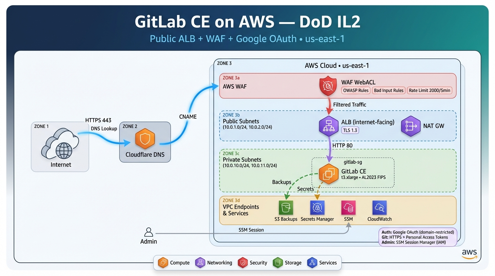

# Self-Hosted GitLab on AWS

Terraform infrastructure for deploying a self-hosted GitLab instance on AWS with a security-hardened network design aligned with DoD IL2 requirements. Developers access GitLab directly via HTTPS with Google OAuth authentication. The public ALB is protected by AWS WAF.



## Architecture Overview

GitLab runs on a single EC2 instance inside private subnets. Developers connect over HTTPS to an internet-facing Application Load Balancer, which is protected by AWS WAF (OWASP common rules, known bad inputs, and rate limiting). The ALB terminates TLS 1.3 and forwards traffic to the GitLab instance over HTTP. Outbound internet access (for package updates) is routed through a NAT Gateway in the public subnets. Admin access to the instance is via SSM Session Manager only.

AWS service access from the private subnets is handled via VPC endpoints (S3, SSM, Secrets Manager, CloudWatch Logs), minimizing traffic that traverses the NAT Gateway. All data is encrypted at rest using KMS or AES-256, and all S3 buckets have public access blocked with lifecycle policies that transition objects to Glacier.

## Modules

### `networking`

VPC, subnets, route tables, NAT Gateway, security groups, VPC endpoints, and flow logs.

- VPC (`10.0.0.0/16`) with DNS hostnames enabled
- 2 public subnets and 2 private subnets across 2 AZs
- NAT Gateway (single AZ) with Elastic IP for outbound from private subnets
- Internet Gateway for the public subnets
- Security groups for the ALB, GitLab EC2, and VPC endpoints
- VPC interface endpoints: SSM, SSM Messages, EC2 Messages, Secrets Manager, CloudWatch Logs
- S3 gateway endpoint via route table
- VPC flow logs to S3

### `gitlab`

EC2 instance, EBS volumes, IAM role, S3 backup bucket, and Secrets Manager secrets.

- `t3.xlarge` EC2 instance running Amazon Linux 2023
- 50 GB encrypted root volume + 100 GB encrypted gp3 data volume (`/var/opt/gitlab`)
- IMDSv2 enforced, detailed monitoring enabled
- IAM instance profile with policies for SSM, S3 backups, Secrets Manager, and CloudWatch Logs
- S3 backup bucket with versioning, KMS encryption, and Glacier lifecycle
- Secrets Manager entries for root password, OAuth credentials, and `gitlab-secrets.json`

### `alb`

Internet-facing Application Load Balancer, target group, HTTPS listener, ACM certificate, and access logging.

- Internet-facing ALB spanning 2 public subnets
- HTTPS listener on port 443 with TLS 1.3 policy (`ELBSecurityPolicy-TLS13-1-2-2021-06`)
- ACM certificate with email validation
- Target group forwarding HTTP port 80 with health checks on `/-/health`
- Access logs to a dedicated S3 bucket with Glacier lifecycle
- Deletion protection enabled

### `waf`

AWS WAF WebACL with managed rules and rate limiting.

- OWASP common rules (AWS Managed Rules Common Rule Set)
- Known bad inputs rule group
- Rate limiting to protect against abuse
- Associated with the internet-facing ALB

### `monitoring`

CloudTrail and CloudWatch alarms.

- CloudTrail logging to S3 with log file validation and Glacier lifecycle
- CloudWatch alarms for CPU utilization (>90% for 15 min) and EC2 status check failures

## Prerequisites

- AWS account with appropriate permissions
- Terraform >= 1.0
- A domain name with DNS managed in Cloudflare
- Cloudflare account with DNS zone for your domain
- Google OAuth credentials (for GitLab SSO)

## Usage

```bash
cd terraform
cp terraform.tfvars.example terraform.tfvars  # edit with your values
terraform init
terraform plan
terraform apply
```

After `terraform apply`, approve the ACM certificate validation email sent to the
domain's admin contacts (admin@yourdomain.com, etc.). This is a one-time manual step.

Connect to the instance via SSM:

```bash
aws ssm start-session --target <instance-id>
```

## DNS Configuration (Cloudflare)

DNS is managed via Cloudflare, outside of Terraform. After deployment:

1. Get the ALB DNS name from Terraform outputs: `terraform output alb_dns_name`
2. In Cloudflare, create a CNAME record:
   - **Name:** `gitlab` (or your subdomain)
   - **Target:** The ALB DNS name from step 1
   - **Proxy status:** Proxied (orange cloud) — since the ALB is internet-facing, Cloudflare proxy mode can be enabled for additional DDoS protection and caching

## Outputs

| Output | Description |
|--------|-------------|
| `gitlab_instance_id` | EC2 instance ID |
| `gitlab_private_ip` | Private IP address |
| `alb_dns_name` | ALB DNS name |
| `gitlab_url` | GitLab URL (`https://<domain>`) |
| `backup_bucket` | S3 backup bucket name |
| `ssm_connect_command` | SSM session command |
